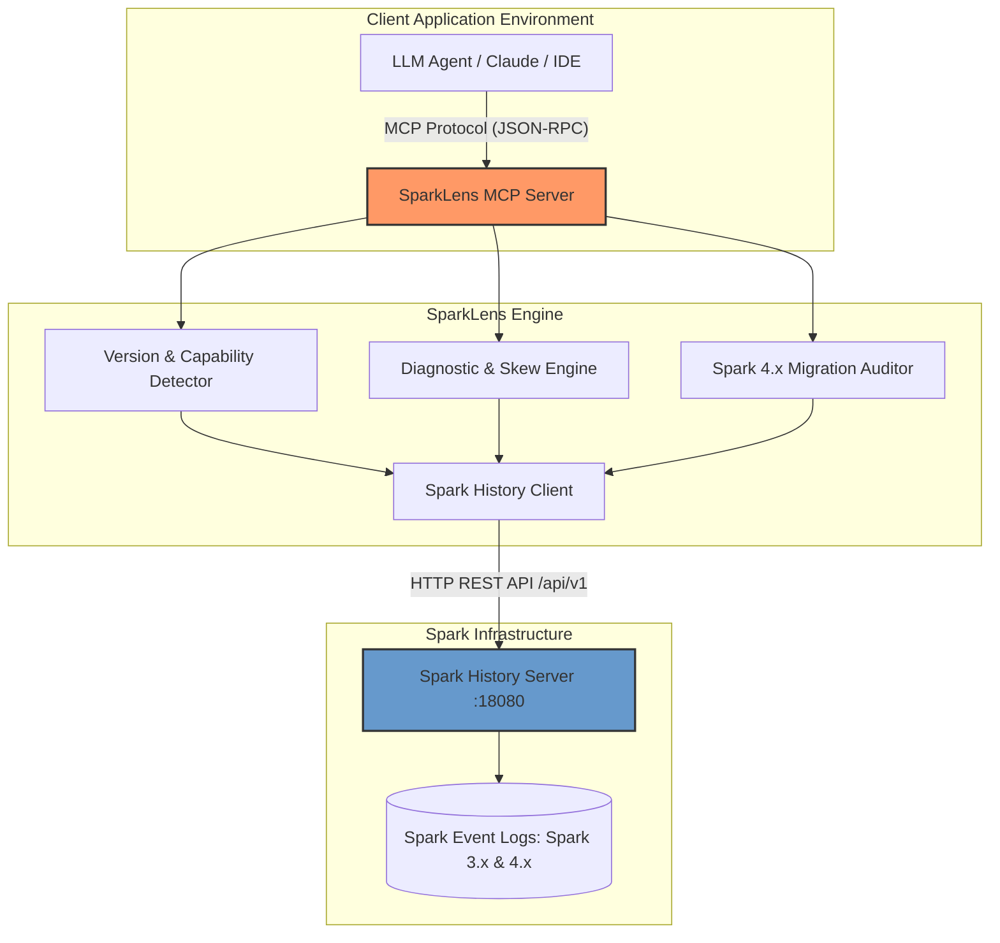

# Architecture Design - SparkLens

This document details the system design, components, data flows, multi-version architecture (Spark 3.x and Spark 4.x), and security configurations for SparkLens.

---

## High-Level Architecture

SparkLens acts as an intelligent intermediary (adapter pattern) translating LLM tool calls (defined under the Model Context Protocol) into REST API invocations against the Apache Spark History Server, dynamically adapting diagnostics based on whether the target application is running Spark 3.x or Spark 4.x.



---

## Multi-Version Spark Support (Spark 3.x & Spark 4.x)

A single Spark History Server instance frequently aggregates event logs across multiple clusters running different Spark versions. SparkLens inspects metadata dynamically per application to adjust diagnostic rules:

| Dimension | Apache Spark 3.x | Apache Spark 4.x | SparkLens Diagnostic Handling |
|---|---|---|---|
| **SQL Semantics** | `spark.sql.ansi.enabled=false` (lenient / returns NULL) | `spark.sql.ansi.enabled=true` (strict / runtime exceptions) | Identifies Spark 4.x ANSI error classes (`CANNOT_DIVIDE_BY_ZERO`, `CAST_INVALID_INPUT`) and suggests safe functions (`try_divide`, `try_cast`). |
| **Error Framework** | Java exception stack traces & generic messages | Standardized structured error classes & SQLSTATE codes | Parses error classes from failure reasons and offers targeted, structured remediations. |
| **Adaptive Query Exec (AQE)** | Off by default in 3.0-3.1, enabled in 3.2+ | Enabled by default with advanced skew join optimizations | Alerts when AQE is disabled in Spark 3.x; suggests parameter tuning (`skewedPartitionThresholdInBytes`) in Spark 4.x. |
| **Shuffle Service Backend** | Default `LEVELDB` | Default `ROCKSDB` (LevelDB deprecated/removed) | Flagged by migration auditor if LevelDB is configured. |
| **Runtime Requirements** | Java 8, 11, 17; Scala 2.12, 2.13 | Java 17, 21; Scala 2.13 (Java 8/11 and Scala 2.12 dropped) | Validates environment runtime versions and flags incompatible JVM flags (e.g. CMS GC). |
| **Spark Connect** | Experimental in 3.4+ | Core feature at parity (`spark.api.mode=connect`) | Differentiates between classic driver and connect sessions. |

---

## Structural Component Layering

```
  ┌───────────────────────────────────────────────────────────┐
  │                    FastMCP Tools Layer                    │
  ├───────────────────┬───────────────────┬───────────────────┤
  │  Discovery Tools  │ Diagnostic Tools  │ Migration Tools   │
  │  (get_version,    │ (analyze_app,     │ (check_spark_     │
  │   list_apps)      │  find_data_skew)  │  compatibility)   │
  └───────────────────┴───────────────────┴───────────────────┘
                                │
                                ▼
  ┌───────────────────────────────────────────────────────────┐
  │                 Diagnostic & Analysis Engine              │
  │  (Version detection, Error Class parser, Skew quantiles)  │
  └───────────────────────────────────────────────────────────┘
                                │
                                ▼
  ┌───────────────────────────────────────────────────────────┐
  │                     Spark API Client                      │
  │  (HTTP client, transport configuration, auth mechanism)  │
  └───────────────────────────────────────────────────────────┘
                                │
                                ▼
  ┌───────────────────────────────────────────────────────────┐
  │                Apache Spark History Server                │
  └───────────────────────────────────────────────────────────┘
```

1. **FastMCP Tools Layer**:
   - **Discovery Tools**: Version resolution (`get_spark_version`), application listing, metadata fetching.
   - **Deep-Dive Data Tools**: Jobs, stages, task summaries, executors, SQL query plans.
   - **Diagnostic Tools**: Version-aware health report (`analyze_application`), failed stage categorization (`find_failed_stages`, `explain_stage_failure`), and skew analysis (`find_data_skew`).
   - **Migration & Compatibility Tools**: Spark 4.x readiness check (`check_spark_compatibility`).
2. **Diagnostic & Analysis Engine**:
   - Performs client-side calculations (quantile distributions, skew ratios) and error class recognition to conserve LLM tokens.
3. **Spark API Client Layer**:
   - Handles connection pooling, timeouts, basic/bearer authentication, and endpoint routing.

---

## Security Architecture

- **Anonymous/None**: Local development without authentication.
- **Basic Authentication**: Username/password credentials passed in standard HTTP Basic header.
- **OAuth / Bearer Token**: Tokens injected as `Authorization: Bearer <token>`.
- **Data Minimization**: Omits massive event streams and raw physical query trees unless explicitly requested via deep-dive tools.
